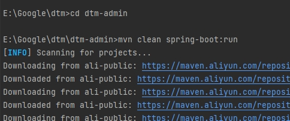
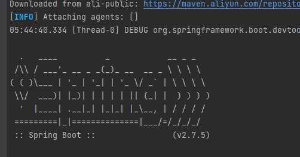
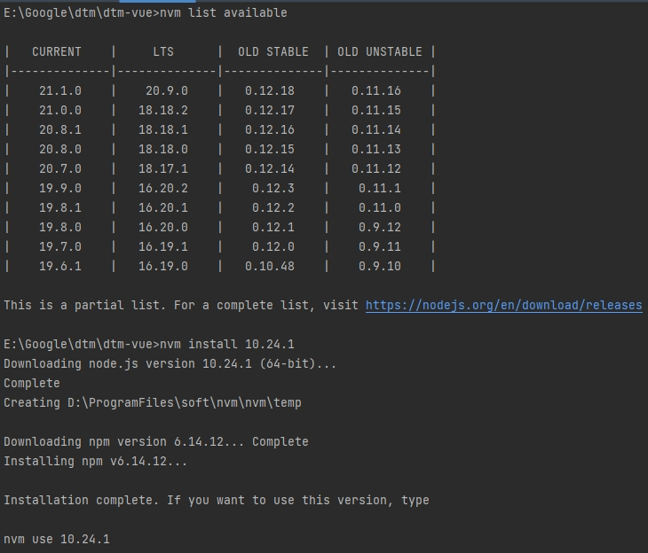
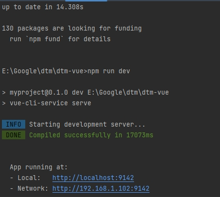
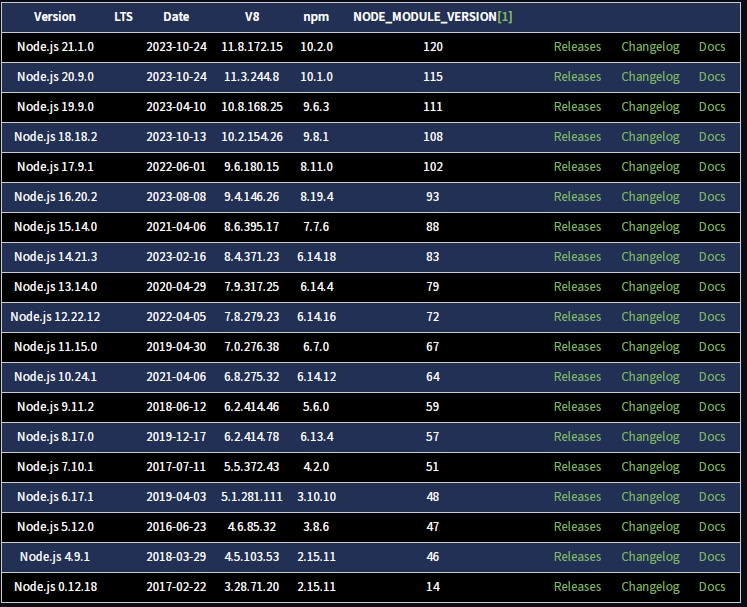
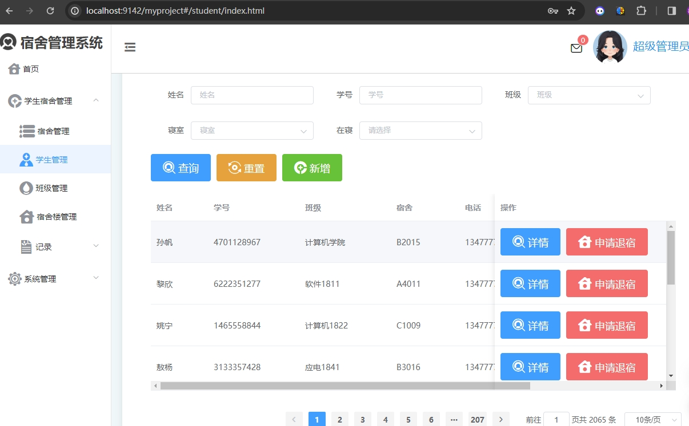
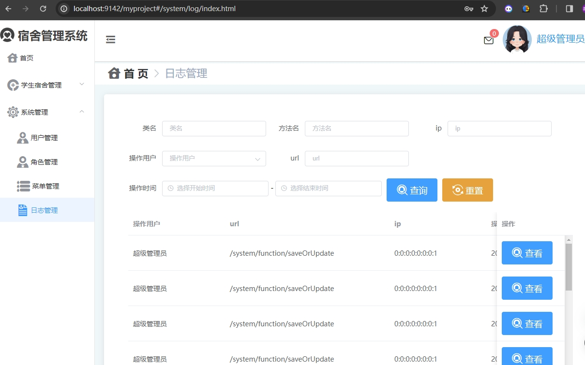
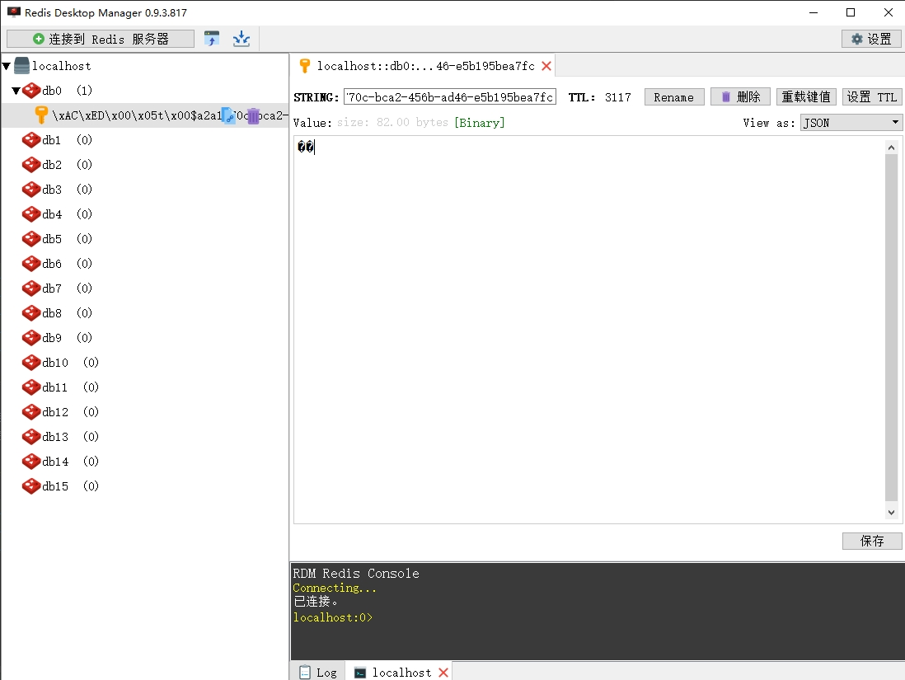

<p align="center">
    <a href='https://docs.oracle.com/en/java/javase/8'></a>
    <a href='https://docs.spring.io/spring-boot/docs/2.6.2-SNAPSHOT/reference/html'></a>
    <a href='https://staging-cn.vuejs.org'></a><br/>
    <a href='#'></a>
    <a href='#'></a>
    <a href='#'></a>
    <a href='#'></a>
</p>

# 宿舍管理系统

#### 开发环境

+ Windows

#### 配置环境

| 程序           | 版本        | 说明                       |
|--------------|-----------|--------------------------|
| Jdk          | 1.8.0 161 | Java 开发工具包               |
| Mysql        | 5.5.27    | 关系型数据库                   |
| Redis        | 7.0.5     | 非关系型数据库                  |
| Apache-maven | 3.9.0     | Java 项目管理和构建工具           |
| Nvm          | 1.10      | Node.js 版本管理器            |
| Node         | 8.12.0    | Node.js JavaScript 运行时环境 |

#### 开发工具

| 工具                       | 版本            | 说明                      |
|--------------------------|---------------|-------------------------|
| IDEA                     | 2022.3.2      | 后前端开发IDE                |
| Git                      | 2.24.1        | 代码托管平台                  |
| Google   Chrome          | 75.0.3770.100 | 浏览器、前端调试工具              |
| Navicat                  | 11.1.13       | 数据库连接工具                 |
| Postman                  | 7.1.0         | 接口测试工具                  |
| VMware   Workstation Pro | 14.1.3        | 虚拟机(未用到或许你会用到)          |
| PowerDesigner            | 15            | 数据库设计工具(未用到或许你会用到)      |
| SQLyog                   | 12.0.3        | 数据库连接工具 (未用到或许你会用到)     |
| Visio                    | 2013          | 时序图、流程图等绘制工具(未用到或许你会用到) |
| ProcessOn                | ——            | 架构图等绘制工具(未用到或许你会用到)     |
| XMind   ZEN              | 9.2.0         | 思维导图绘制工具(未用到或许你会用到)     |
| RedisDesktop             | 0.9.3.817     | redis客户端连接工具(未用到或许你会用到) |

#### 编码规范

- 规范方式：严格遵守阿里编码规约。
- 命名统一：简介最大程度上达到了见名知意。
- 分包明确：层级分明可快速定位到代码位置。
- 注释完整：描述性高大量减少了开发人员的代码阅读工作量。
- 工具规范：使用统一jar包避免出现内容冲突。
- 代码整洁：可读性、维护性高。

#### 包的结构
```
+- dtm -- 整个项目
|   +- .idea -- 包含项目的 IntelliJ IDEA 配置文件
|   +- dtm-admin -- 项目后端
|   |   +- .idea -- 包含后端项目的 IntelliJ IDEA 配置文件
|   |   +- pom.xml -- Maven 项目配置文件
|   |   +- src
|   |   |   +- main
|   |   |   |   +- java
|   |   |   |   |   +- com
|   |   |   |   |   |   +- rabbiter
|   |   |   |   |   |   |   +- dm -- 后端项目的主要包
|   |   |   |   |   |   |   |   +- annotation -- 自定义注解
|   |   |   |   |   |   |   |   |   +- Log.java -- 日志注解
|   |   |   |   |   |   |   |   |   +- RequirePermission.java -- 权限注解
|   |   |   |   |   |   |   |   +- aop -- 切面编程相关代码
|   |   |   |   |   |   |   |   |   +- LogAop.java -- 日志切面
|   |   |   |   |   |   |   |   +- config -- 配置类
|   |   |   |   |   |   |   |   |   +- Constant.java -- 常量定义
|   |   |   |   |   |   |   |   |   +- DataSourceConfiguration.java -- 数据源配置
|   |   |   |   |   |   |   |   |   +- GlobalExceptionHandler.java -- 全局异常处理
|   |   |   |   |   |   |   |   |   +- MyConfig.java -- 自定义配置
|   |   |   |   |   |   |   |   +- controller -- 控制器层
|   |   |   |   |   |   |   |   |   +- BackLateController.java -- 后勤控制器
|   |   |   |   |   |   |   |   |   +- BuildingController.java -- 宿舍楼控制器
|   |   |   |   |   |   |   |   |   +- DepartApplicationController.java -- 请假申请控制器
|   |   |   |   |   |   |   |   |   +- FacultyController.java -- 学院控制器
|   |   |   |   |   |   |   |   |   +- LeaveController.java -- 请假控制器
|   |   |   |   |   |   |   |   |   +- LoginController.java -- 登录控制器
|   |   |   |   |   |   |   |   |   +- NoticeController.java -- 通知控制器
|   |   |   |   |   |   |   |   |   +- PermissionController.java -- 权限控制器
|   |   |   |   |   |   |   |   |   +- RepairController.java -- 维修控制器
|   |   |   |   |   |   |   |   |   +- RoomController.java -- 宿舍控制器
|   |   |   |   |   |   |   |   |   +- StatisticsController.java -- 统计控制器
|   |   |   |   |   |   |   |   |   +- StudentController.java -- 学生控制器
|   |   |   |   |   |   |   |   |   +- SystemFunctionController.java -- 系统功能控制器
|   |   |   |   |   |   |   |   |   +- SystemLogController.java -- 系统日志控制器
|   |   |   |   |   |   |   |   |   +- SystemRoleController.java -- 系统角色控制器
|   |   |   |   |   |   |   |   |   +- SystemUserController.java -- 系统用户控制器
|   |   |   |   |   |   |   |   +- dao -- 数据访问层
|   |   |   |   |   |   |   |   |   +- BackLateMapper.java -- 后勤数据访问接口
|   |   |   |   |   |   |   |   |   +- BuildingMapper.java -- 宿舍楼数据访问接口
|   |   |   |   |   |   |   |   |   +- DepartApplicationMapper.java -- 请假申请数据
|   |   |   |   |   |   |   |   |   +- FacultyMapper.java -- 用于与数据库进行 Faculty 实体的交互，包括增删改查等操作
|   |   |   |   |   |   |   |   |   +- ImageMapper.java -- 用于与数据库进行 Image 实体的交互，包括增删改查等操作
|   |   |   |   |   |   |   |   |   +- LeaveMapper.java -- 用于与数据库进行 Leave 实体的交互，包括增删改查等操作
|   |   |   |   |   |   |   |   |   +- NoticeMapper.java -- 用于与数据库进行 Notice 实体的交互，包括增删改查等操作
|   |   |   |   |   |   |   |   |   +- RepairMapper.java -- 用于与数据库进行 Repair 实体的交互，包括增删改查等操作
|   |   |   |   |   |   |   |   |   +- RoomMapper.java -- 用于与数据库进行 Room 实体的交互，包括增删改查等操作
|   |   |   |   |   |   |   |   |   +- StudentMapper.java -- 用于与数据库进行 Student 实体的交互，包括增删改查等操作
|   |   |   |   |   |   |   |   |   +- SystemFunctionMapper.java -- 用于与数据库进行 SystemFunction 实体的交互，包括增删改查等操作
|   |   |   |   |   |   |   |   |   +- SystemLogMapper.java -- 用于与数据库进行 SystemLog 实体的交互，包括增删改查等操作
|   |   |   |   |   |   |   |   |   +- SystemRoleMapper.java -- 用于与数据库进行 SystemRole 实体的交互，包括增删改查等操作
|   |   |   |   |   |   |   |   |   +- SystemUserMapper.java -- 用于与数据库进行 SystemUser 实体的交互，包括增删改查等操作
|   |   |   |   |   |   |   |   |   +- DormitoryManagerApplication.java -- 主启动类，包含应用程序的入口点，负责启动整个应用程序
|   |   |   |   |   |   |   |   |   +- dto -- 存放数据传输对象（Data Transfer Object），用于在不同层之间传输数据
|   |   |   |   |   |   |   |   |   |   +- ListQuery.java -- 用于封装列表查询条件的数据传输对象
|   |   |   |   |   |   |   |   |   |   +- Message.java -- 用于封装消息的数据传输对象
|   |   |   |   |   |   |   |   |   |   +- Password.java -- 用于封装密码的数据传输对象
|   |   |   |   |   |   |   |   +- entity -- 存放实体类，与数据库表一一对应
|   |   |   |   |   |   |   |   |   +- BackLate.java -- 学生迟到信息的实体类
|   |   |   |   |   |   |   |   |   +- Building.java -- 宿舍楼信息的实体类
|   |   |   |   |   |   |   |   |   +- DepartApplication.java -- 离校申请信息的实体类
|   |   |   |   |   |   |   |   |   +- DepartApplicationUser.java -- 离校申请用户关联信息的实体类
|   |   |   |   |   |   |   |   |   +- Faculty.java -- 学院信息的实体类
|   |   |   |   |   |   |   |   |   +- Image.java -- 图片信息的实体类
|   |   |   |   |   |   |   |   |   +- Leave.java -- 学生请假信息的实体类
|   |   |   |   |   |   |   |   |   +- Notice.java -- 系统通知信息的实体类
|   |   |   |   |   |   |   |   |   +- Repair.java -- 宿舍报修信息的实体类
|   |   |   |   |   |   |   |   |   +- Room.java -- 宿舍房间信息的实体类
|   |   |   |   |   |   |   |   |   +- Student.java -- 学生信息的实体类
|   |   |   |   |   |   |   |   |   +- SystemFunction.java -- 系统功能信息的实体类
|   |   |   |   |   |   |   |   |   +- SystemLog.java -- 系统日志信息的实体类
|   |   |   |   |   |   |   |   |   +- SystemRole.java -- 系统角色信息的实体类
|   |   |   |   |   |   |   |   |   +- SystemUser.java -- 系统用户信息的实体类
|   |   |   |   |   |   |   |   |   +- TestDO.java -- 测试数据对象的实体类
|   |   |   |   |   |   |   |   +- exception -- 存放自定义异常类
|   |   |   |   |   |   |   |   |   +- HttpException.java -- HTTP 异常类
|   |   |   |   |   |   |   |   +- interceptor -- 存放拦截器
|   |   |   |   |   |   |   |   |   +- LoginInterceptor.java -- 登录拦截器
|   |   |   |   |   |   |   |   |   +- SecurityInterceptor.java -- 安全拦截器
|   |   |   |   |   |   |   |   +- scheduled -- 存放定时任务
|   |   |   |   |   |   |   |   |   +- LogClean.java -- 日志清理定时任务
|   |   |   |   |   |   |   |   +- BackLateService.java -- 学生迟到信息的服务接口
|   |   |   |   |   |   |   |   +- BuildingService.java -- 宿舍楼信息的服务接口
|   |   |   |   |   |   |   |   +- DepartApplicationService.java -- 离校申请信息的服务接口
|   |   |   |   |   |   |   |   +- FacultyService.java -- 学院信息的服务接口
|   |   |   |   |   |   |   |   +- ImageService.java -- 图片信息的服务接口
|   |   |   |   |   |   |   |   +- LeaveService.java -- 学生请假信息的服务接口
|   |   |   |   |   |   |   |   +- NoticeService.java -- 系统通知信息的服务接口
|   |   |   |   |   |   |   |   +- RepairService.java -- 宿舍报修信息的服务接口
|   |   |   |   |   |   |   |   +- RoomService.java -- 宿舍房间信息的服务接口
|   |   |   |   |   |   |   |   +- StatisticsService.java -- 统计信息的服务接口
|   |   |   |   |   |   |   |   +- StudentService.java -- 学生信息的服务接口
|   |   |   |   |   |   |   |   +- SystemFunctionService.java -- 系统功能信息的服务接口
|   |   |   |   |   |   |   |   +- SystemLogService.java -- 系统日志信息的服务接口
|   |   |   |   |   |   |   |   +- SystemRoleService.java -- 系统角色信息的服务接口
|   |   |   |   |   |   |   |   +- SystemUserService.java -- 系统用户信息的服务接口
|   |   |   |   |   |   |   +- socket -- 存放与 WebSocket 相关的类
|   |   |   |   |   |   |   |   +- WebSocket.java -- WebSocket 实现类
|   |   |   |   |   |   |   +- utils -- 存放工具类
|   |   |   |   |   |   |   |   +- FileUtil.java -- 文件工具类
|   |   |   |   |   |   |   |   +- HttpCode.java -- HTTP 状态码常量类
|   |   |   |   |   |   |   |   +- JWTUtil.java -- JWT 工具类
|   |   |   |   |   |   |   |   +- Match.java -- 匹配工具类
|   |   |   |   |   |   |   |   +- MD5Util.java -- MD5 加密工具类
|   |   |   |   |   |   |   |   +- RedisUtil.java -- Redis 工具类
|   |   |   |   |   |   |   +- vo -- 存放值对象（Value Object）
|   |   |   |   |   |   |   |   +- Result.java -- 封装操作结果的值对象
|   |   |   |   +- resources -- 存放配置文件等资源
|   |   +- target -- 存放编译生成的类文件
|   +- dtm-vue -- 项目前端
|   |   +- .browserslistrc -- 浏览器兼容性配置文件
|   |   +- .env.development -- 开发环境的环境变量配置
|   |   +- .env.production -- 生产环境的环境变量配置
|   |   +- .env.staging -- 演示环境的环境变量配置
|   |   +- .eslintrc.js -- ESLint 配置文件，用于规范 JavaScript 代码风格
|   |   +- .npmrc -- npm 配置文件
|   |   +- babel.config.js -- Babel 配置文件，用于编译 JavaScript 新特性
|   |   +- node_modules -- 存放前端项目依赖的 Node.js 模块
|   |   +- package-lock.json -- 记录当前状态下实际安装的各个npm package的具体来源和版本号，以便重复安装时依赖包的版本一致
|   |   +- package.json -- 包含了项目的元信息和依赖关系
|   |   +- public -- 存放静态资源
|   |   |   +- 02.jpg -- 图片资源
|   |   |   +- favicon.ico -- 网站图标
|   |   |   +- index.html -- 主页 HTML 文件
|   |   +- README.md -- 项目前端的说明文档
|   |   +- src -- 存放前端源代码
|   |   |   +- api -- 存放前端与后端交互的 API 接口
|   |   |   +- App.vue -- Vue.js 应用的根组件
|   |   |   +- assets -- 存放静态资源，如样式和图片
|   |   |   +- components -- 存放 Vue 组件
|   |   |   +- ComponentsMap.js -- 组件映射文件
|   |   |   +- directives -- 存放自定义指令
|   |   |   +- main.js -- 主入口文件，初始化Vue应用
|   |   |   +- permission.js -- 权限控制配置文件
|   |   |   +- router -- 存放路由配置
|   |   |   +- store -- 存放 Vuex 状态管理相关文件
|   |   |   +- utils -- 存放工具函数
|   |   |   +- views -- 存放页面组件
|   |   +- vue.config.js -- Vue CLI 配置文件
|   +- Images -- 存放项目中使用的图片资源
|   +- README.md -- 整个项目的说明文档
|   +- sql
|   |   +- dormitory_manager.sql -- 数据库脚本文件，用于初始化数据库结构
```

#### 后端技术栈

| 技术                             | 版本            | 说明                          |
|--------------------------------|---------------|-----------------------------|
| Spring Boot Starter Parent      | 2.7.5         | Spring Boot 的启动器父项目    |
| Druid Spring Boot Starter       | 1.2.4         | 阿里巴巴数据库连接池            |
| Log4j                          | 1.2.17        | 日志记录工具                   |
| PageHelper Spring Boot Starter  | 1.4.1         | MyBatis 分页插件               |
| Spring Boot Starter Web         | -             | Spring Boot Web 启动器         |
| Spring Boot Starter Web Services| -             | Spring Boot Web Services 启动器|
| MyBatis Spring Boot Starter     | 2.1.4         | MyBatis Spring Boot 启动器    |
| Spring Boot DevTools            | -             | Spring Boot 开发工具            |
| MySQL Connector/J               | 8.0.31        | MySQL 数据库连接器             |
| Spring Boot Starter Test         | -             | Spring Boot 测试启动器         |
| Java JWT                        | 3.10.1        | Java JSON Web Token 库         |
| Spring Boot Starter Data Redis   | -             | Spring Boot Redis 启动器        |
| Spring Boot Starter AOP         | -             | Spring Boot 切面编程启动器      |
| Spring Boot Starter WebSocket   | -             | Spring Boot WebSocket 启动器   |
| Validation API                  | -             | Java 验证 API                  |
| Hibernate Validator             | -             | Hibernate 验证框架             |


#### 前端技术栈

| 技术                             | 版本            | 说明                          |
|--------------------------------|---------------|-----------------------------|
| @riophae/vue-treeselect         | ^0.4.0        | Vue 树形选择组件               |
| axios                          | ^0.21.0       | 基于 Promise 的浏览器和 Node.js HTTP 客户端 |
| core-js                        | ^3.6.5        | ECMAScript 标准库             |
| element-ui                     | ^2.14.1       | Vue.js 2.0 的 UI 工具包        |
| js-cookie                      | ^2.2.1        | 处理 Cookie 的 JavaScript API   |
| path-to-regexp                 | ^6.2.0        | Express 风格的路径到正则表达式的实用工具 |
| sass-loader                    | ^10.1.0       | 用于 webpack 的 Sass 加载器      |
| scss                           | ^0.2.4        | JavaScript 的 Syntactically Awesome Stylesheets (Sass) |
| splitpanes                     | ^2.3.6        | Vue.js 2 的 splitpanes 组件     |
| vue                            | ^2.6.11       | Vue.js - JavaScript 框架        |
| vue-echarts                    | ^6.0.0-rc.3   | Vue 的 ECharts 封装组件        |
| vue-json-viewer                | ^2.2.17       | Vue 的 JSON 查看器组件          |
| vue-router                     | ^3.2.0        | Vue.js 的官方路由器              |
| vue-vibe                       | ^8.0.3        | Vue.js 2.0 的 UI 工具包        |
| vuex                           | ^3.6.0        | Vue.js 的状态管理              |
| @vue/cli-plugin-babel          | ~4.5.0        | Vue CLI 的 Babel 插件          |
| @vue/cli-plugin-eslint         | ~4.5.0        | Vue CLI 的 ESLint 插件         |
| @vue/cli-plugin-router         | ~4.5.0        | 为 Vue CLI 添加路由的插件       |
| @vue/cli-service               | ~4.5.0        | Vue CLI 的本地服务             |
| babel-eslint                   | ^10.1.0       | 具有 ESLint 语法支持的 Babel 解析器 |
| babel-plugin-component         | ^1.1.1        | 用于导入 Vue 组件的 Babel 插件   |
| eslint                         | ^6.7.2        | 用于识别和修复代码的可插拔工具   |
| eslint-plugin-vue               | ^6.2.2        | Vue.js 的官方 ESLint 插件       |
| lint-staged                    | ^9.5.0        | 在提交之前运行 linters 的工具   |
| vue-template-compiler           | ^2.6.11       | Vue.js 的模板编译器            |

#### 安装教程
1.  在navicat中运行数据库脚本生成对应的数据库表
2.  在src/main/resources/application.yml文件里更改数据库(Redis/Mysql)名称或数据库密码
3.  在pom.xml文件的父目录运行 mvn clean spring-boot:run 启动后端
4.  启动前端 你可以在package.json的父目录执行下如命令 或者 直接在IDEA里点击也可运行 值得一提的是后两命令分别是打包命令和检查修复命令

```
npm install
```
```
npm run serve
```
```
npm run build
```
```
npm run lint
```
+ 如下图所示







#### 登录账户

用户名：superadmin
密码：123456

#### 截图





